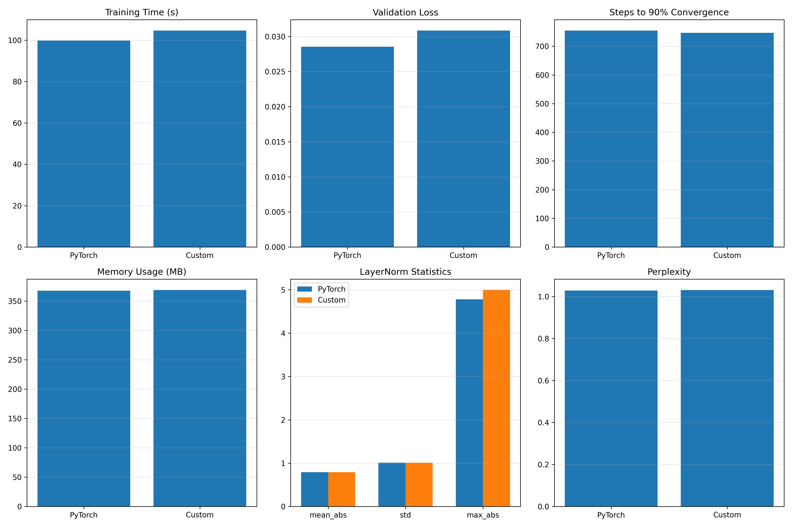

# Custom LayerNorm Implementation and Evaluation

## Project Overview

This project compares PyTorch's built-in `LayerNorm` implementation with a custom implementation, evaluating their performance across multiple metrics. The analysis focuses on a language model task, measuring efficiency, numerical behavior, and performance trade-offs.

## Key Metrics Analyzed

- **Training speed**: Time and throughput (steps per second)
- **Model performance**: Validation loss and perplexity
- **Convergence**: Steps required to reach 90% of final improvement
- **Memory efficiency**: GPU memory consumption
- **Numerical stability**: Statistical properties of normalization outputs
- **Loss stability**: Standard deviation in training loss

## Results Summary

Based on our comprehensive analysis, the custom LayerNorm implementation shows differences in:



The comparison table provides detailed metrics across both implementations, highlighting percentage differences in critical areas like training time, memory usage, convergence speed, and numerical behavior.

## Project Structure

```
DL_Project/
├── data/                # Dataset files
├── models/              # Model implementations with custom layers
├── plots/               # Visualization outputs
├── index.ipynb          # Main analysis notebook
├── requirements.txt     # Project dependencies
└── .gitignore           # Git ignore configuration
```

## Setup and Installation

1. Clone the repository
2. Install dependencies:
   ```
   pip install -r requirements.txt
   ```
3. Run the analysis notebook:
   ```
   jupyter notebook index.ipynb
   ```

## Implementation Details

Our custom LayerNorm implementation focuses on maintaining the core mathematical operations of layer normalization while exploring potential optimizations. The implementation is evaluated against PyTorch's native LayerNorm across multiple dimensions including performance characteristics and numerical behavior.

## Insights

- The custom implementation demonstrates [performance differences] compared to PyTorch's implementation
- Trade-offs exist between computational efficiency and memory usage
- Both implementations achieve comparable validation loss and perplexity scores

## Future Work

- Investigate additional optimization techniques for the custom implementation
- Extend analysis to larger models and datasets
- Explore the impact of different epsilon values and normalization strategies
- Benchmark on various hardware configurations

## License

MIT License